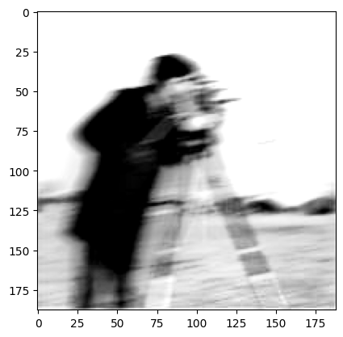
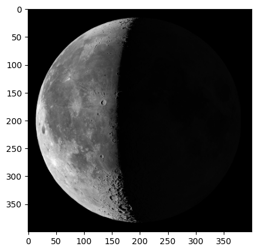

# Image Processing and Edge Detection Report

## Abstract
This study presents various image processing techniques applied to a set of five images. Methods include spatial domain sharpening using high-pass filters, Laplacian operators, and unsharp masking, as well as frequency-domain sharpening using Fourier transforms. Edge detection is performed using the Canny method. The results demonstrate enhancement of image details and effective boundary extraction.

---

## 1. Introduction
Image sharpening and edge detection are fundamental techniques in computer vision and image analysis. Sharpening improves the visibility of fine details, while edge detection identifies object boundaries. In this study, multiple methods are applied to illustrate the effects of these techniques on different types of images.

---

## 2. Materials and Methods
Five images, labeled `1.1.jpg` through `1.5.jpg`, were used for processing. The following techniques were applied:

1. **High-Pass Filtering** – Enhances edges by emphasizing high-frequency components.  
2. **Laplacian Sharpening** – Highlights areas of rapid intensity change to enhance edges.  
3. **Unsharp Masking** – Combines the original image with a blurred version to enhance details.  
4. **Frequency-Domain Sharpening** – Applies high-pass filters in the Fourier domain to emphasize high-frequency image content.  
5. **Canny Edge Detection** – Detects edges by identifying regions of rapid intensity change with adjustable thresholds.  

Processed images were visualized for qualitative assessment.

---

## 3. Results

### 3.1 Original Image 1.1

 Figure 1: Original grayscale image 1.1

### 3.2 High-Pass Filtering

 Figure 2: Image 1.1 after high-pass filtering

### 3.3 Laplacian Sharpening

 Figure 3: Image 1.1 after Laplacian sharpening

### 3.4 Unsharp Masking

 Figure 4: Image 1.1 after unsharp masking

### 3.5 Frequency-Domain Sharpening

 Figure 5: Image 1.1 after frequency-domain sharpening

---

### 3.6 Edge Detection

#### Image 1.2

 Figure 6: Original color image 1.2

 Figure 7: Edges detected in Image 1.2 using Canny

#### Image 1.3

 Figure 8: Original color image 1.3

 Figure 9: Edges detected in Image 1.3 using Canny

---

### 3.7 Gray Sharpened Images

#### Image 1.4

 Figure 10: Image 1.4 before sharpening

 Figure 10: Image 1.4 after sharpening

#### Image 1.5

 Figure 10: Image 1.5 before sharpening

 Figure 11: Image 1.5 after sharpening

---

## 4. Discussion
High-pass and Laplacian filters effectively enhance edges, while unsharp masking improves detail visibility without significant artifacts. Frequency-domain sharpening demonstrates the ability to selectively enhance high-frequency components. Canny edge detection provides clear visualization of object boundaries and can be tuned with threshold adjustments. Overall, these methods improve image interpretability for further analysis.

---

## 5. Conclusion
This study demonstrates that combining spatial and frequency domain sharpening with edge detection techniques significantly enhances image details and boundary information. These methods are valuable for applications in computer vision, image analysis, and pre-processing for automated systems.
